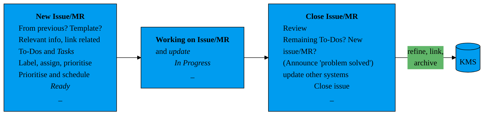

>[!todo] Link to LWP GitLab Wiki #project/obsidian-wiki #idea/lwp

See also [[personal/tech/software/Gitlab|my notes on GitLab]] and [[../../rug/lwp/GitLab|LWP: GitLab]]

**Table of Contents**

<!-- This automatically creates a Table of Contents. Unfortunately there doesn't seem to be a way to exlude headings from it, so if one creates a heading for the ToC, it shows up in the ToC itself. -->
[[_TOC_]]

To automatically create a table of contents for a page just add the following line
```markdown
[[_TOC_]]
```

---

See also [presentation on GitLab](sebastian/2023_presentation_GitLab/slides.html)


# Issues and Merge Requests

## New Issue or Merge Request


See [[Markdown#Graphs: Mermaid|notes on Mermaid graphs]] for reference.


### Templates

[GitLab description templates](https://git.lwp.rug.nl/help/user/project/description_templates)

- issues and merge requests
- in projects, groups or instance with downward inheritance
- example: guidelines for description, checklist with mandatory tests
- `.md` extension, in `.gitlab/{issue_templates,merge_request_templates}` directories on default branch
- GitLab uses `Default.md` as default, [MR variables](https://git.lwp.rug.nl/help/user/project/description_templates#supported-variables-in-merge-request-templates) only work in this template

## Merge Requests

If WIP mark it as draft by ticking the checkbox or start title with `Draft:`.

### Review

In the <em>Changes</em> section GitLab offers a great tool for WIP MRs and collaboration. Changes to the code are shown as diffs with respect to the reference branch and there's a feature to discuss changes and collaborate on solutions.


## Linking/referencing Items

For an issue on the same project the shorthand `#...` with the issue number works. Starting to type  `#` gives a list of issues.

The same works with MRs by using `!...`. This will also show the MR status (e.g. <em>merged</em>).

To link items from a different project use `group/project/...` followed by the issue or MR reference or copy the whole URL.

To link issues and merge requests the most benefits are achieved by mentioning an issue in a merge request *description*. This will create an entry <em>Related Merge Requests</em> on the issue and show up in the MR activity.

See also [presentation on GitLab](sebastian/2023_presentation_GitLab/slides.html#/referencing-linking/0).

## Issue Boards


# Markdown and HTML

Commenting: `<!-- ... -->`
```markdown
<!-- This is a
comment -->
```


# GitLab Webinterface

## Labels
Start typing `~` for available labels, for example ~"In progress" ~Ready ~Blocked. Use double ticks for labels with spaces, e.g. `~"In progress"`.


## Emojis
Start typing `:` to get suggestions/a search
- :construction: WIP: `:construction:`
- :gear: running: `:gear:`
- :x: error: `:x:`
- :white_check_mark: successful: `:white_check_mark:`


## Icons
[Gitlab SVG icons](https://gitlab.com/gitlab-org/gitlab-svgs/-/tree/main/sprite_icons)
-  Wiki:
  - local (Wiki):
    ```Markdown
    
    ```
  - remote (issue/MR):
    ```Markdown
    
    ```
-  Issue:
  - local (Wiki):
    ```Markdown
    
    ```
  - remote (issue/MR):
    ```Markdown
    
    ```
-  Open Merge Request:
  - local (Wiki):
    ```Markdown
    
    ```
  - remote (issue/MR):
    ```Markdown
    
    ```
-  Merged Merge Request:
  - local (Wiki):
    ```Markdown
    
    ```
  - remote (issue/MR):
    ```Markdown
    
    ```


# Wiki

GitLab CE doesn't allow for group Wikis, so ours is in a separate project called `wiki`.

The GitLab Wiki Webinterface is very limited. The only way to browse pages is by manually creating references, for example on the [Home page](https://git.lwp.rug.nl/lwp/wiki/-/wikis/home) and in the sidebar. The latter is the same for any page visited, so a fairly good place to have a general table of contents. It is reommenced to edit and view the Wiki with external tools.


# Activity

See for example [presentation on GitLab](sebastian/2023_presentation_GitLab/slides.html#/merge-activity---changelog)


# Miscellaneous

For more (obscure) features of GitLab see [presentation on GitLab](sebastian/2023_presentation_GitLab/slides.html#/honourable-mentions/5)

<ul>
<li><a href="https://docs.gitlab.com/ee/user/project/issues/create_issues.html#from-another-issue-or-incident">new issue from another (related) issue</a></li>
<li><a href="https://docs.gitlab.com/ee/user/project/repository/branches/#compare-branches">comparing branches</a></li>
<li><a href="https://docs.gitlab.com/ee/user/snippets.html">snippets</a></li>
<li><a href="https://docs.gitlab.com/ee/user/project/badges">Badges</a></li>
<li>Create issue from <a href="https://docs.gitlab.com/ee/user/project/issues/create_issues.html#by-sending-an-email">e-mail</a> or <a href="https://docs.gitlab.com/ee/user/project/issues/create_issues.html#using-a-url-with-prefilled-values">URL</a></li>
<li><a href="https://docs.gitlab.com/ee/user/project/issues/managing_issues.html#closing-issues-automatically">Commit message closing patterns</a></li>
</ul>