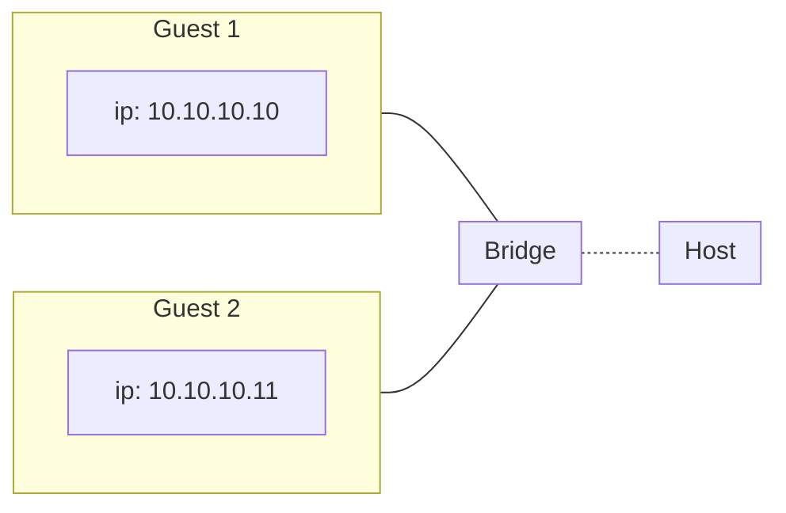
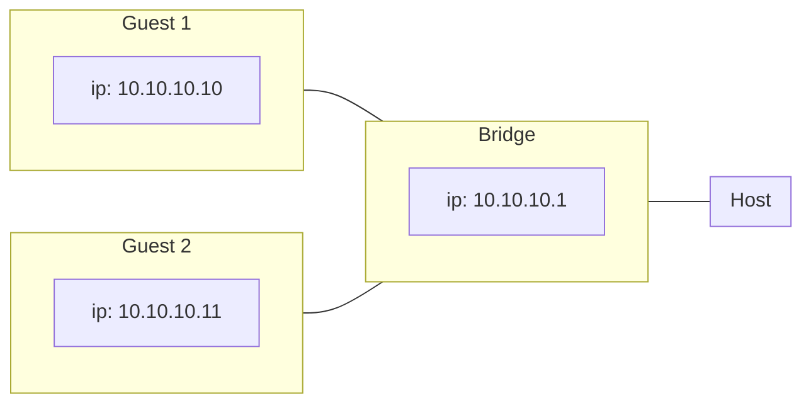

# Networking

## IP Address, Mask, Gateway

- gateway server: where to send packages?
- DNS server: resolve domain names to IPs

> [!info] IPv4
> Four 8-bit numbers `0-255.0-255.0-255.0-255` (total 32 bits)
>
> Subnet mask defining routing prefix, alternatively with CIDR notation
> Example: subnet mask `255.255.255.0` (24 bits fixed, 8 variable) is equivalent to CIDR notation  `x.x.x.1/24`

> [!info] IPv6
> Eight 16-bit numbers (hexadecimal) (total 128 bits)

## Ports

[IANA (Internet Assigned Numbers Authority): Service Name and Transport Protocol Port Number Registry](https://www.iana.org/assignments/service-names-port-numbers/service-names-port-numbers.txt) ^d2523a

> [!example] Excerpt
>
> ```
> Service   Port    Transport   Description
> Name     Number   Protocol
> socks     1080        tcp       Socks
> socks     1080        udp       Socks
> ```

## Technologies and Protocols

> [!info] What is a protocol?[^1]
> In networking, a protocol is a standardized set of rules for formatting and processing data. Protocols enable computers to communicate with one another.

[^1]: <https://www.cloudflare.com/en-gb/learning/network-layer/what-is-a-protocol/>

### Protocols

```dataview
TABLE WITHOUT ID
("[" + acronym + "](" + file.path + ")") AS "Acronym",
full-name AS "Name",
desc-short AS "Description"
WHERE contains(file.path,"networking/protocols")
```

### OSI Model

[Wikipedia: OSI model](https://en.wikipedia.org/wiki/OSI_model "Wikipedia: OSI model")

7 layers to differentiate protocols

- layer 1: physical layer
- layer 2: data link layer
- layer 3: network layer
- layer 4: transport layer
- layer 5: session layer
- layer 6: presentation layer
- layer 7: application layer


### Bridging

Public Bridged Network: host ethernet adapter is added to bridge, giving guests access to host's network.

Private Bridged Network: guests communicate via manual addresses. DHCP and other services can be provided. NAT can be established through routing on the host.

Creating a bridge: use e.g. `ip` for a temporary bridge or Network Manager, netplan, ifupdown etc. to create a permanent bridge (`br0` is a commonly used name).
A private network for a guest can for example be created using a TAP device.[^tun-tap]

```bash
# set up a temporary bridge
sudo ip link add br0 type bridge
sudo ip link set br0 up
# (optional) create TAP devices for guests
sudo ip tuntap add tap1 mode tap && ip link set tap1 up promisc on
# attach device to bridge
sudo ip link set tap1 master br0
# allow guest-guest communication by assigning them ip addresses, e.g. through GUI
# allow host-guest communication by assigning the bridge an address on the private network
sudo ip addr add <ip address> dev br0
```

And optionally set up DHCP on this bridge, e.g. with dnsmasq.

```bash
sudo dnsmasq --interface=br0 --bind-interfaces --dhcp-range=10.10.10.2,10.10.10.100
```

<figure>



<caption>Guest-only private network</caption>
</figure>
<figure>



<caption>Host-only private network</caption>
</figure>

Add NAT and routing to allow guests on the PN to communicate beyond the host (didn't get that to work yet): ^nat

```bash
# non-persistent, using iptables
# enable ip packet forwarding through kernel paramater
sudo sysctl -w net.ipv4.ip_forward=1
# using iptables
# add firewall exception
sudo iptables -A FORWARD -i br0 -j ACCEPT
# add NAT
sudo iptables -t nat -I POSTROUTING -s 10.10.10.1/24 -j MASQUERADE
# using Firewalld
sudo firewall-cmd [--permanent] --zone=testing --add-interface=br0
sudo firewall-cmd [--permanent] --zone=testing --add-source=10.10.10.0/24
sudo firewall-cmd [--permanent] --zone=testing --add-masquerade
sudo firewall-cmd [--permanent] --zone=testing --add-forward
sudo firewall-cmd [--permanent] --zone=testing --add-target=ACCEPT
```


### Wireless

- [[#5G]]

### Security

[[public/tech/networking/security|Networking: Security]]

- [[public/tech/networking/security#TLS|TLS]]
- [[public/tech/networking/security#SSL|SSL]]
- [[public/tech/networking/security#SASL|SASL]]

## Network Managers

### Netplan

[Netplan documentation](https://netplan.readthedocs.io/en/latest/)

- [YAML configuration](https://netplan.readthedocs.io/en/latest/netplan-yaml/)


## Load Balancing

- [[nginx]]: HTTPq
- [HAProxy](https://www.haproxy.org/): TCP/HTTP
- [LVS (Linux Virtual Server)](http://www.linuxvirtualserver.org/whatis.html)


## Tools

Tags: #tech/networking/tools

> [!info] General toolkit ^0fd526
>
> - [[ICMP]]
> - [[ping]] and [[traceroute]]
> - [[wireshark]]
> - NSLookpup
> - Netstat
> - Network Management
> - Show and debug
> - Discovery ...
> - ...

`ip` #tech/networking/tools/ip

- network namespaces
    - create virtual route/network between VM and host ^[https://docker-k8s-lab.readthedocs.io/en/latest/docker/netns.html]

        ```bash
        # create network namespace for VM
        sudo ip netns add myns
        ip netns list
        # execute command in new network namespace
        sudo ip netns exec myns ip addr
        # create a virtual interface pair, it has two virtual interfaces which are connected by a virtual cable
        sudo ip link add veth-a type veth peer name veth-b
        # move one interface to new namespace
        sudo ip link set veth-b netns myns
        # assign IP addresses and bring interfaces up
        sudo ip addr add 192.168.1.1/24 dev veth-a
        sudo ip link set veth-a up
        sudo ip netns exec myns ip addr add 192.168.1.2/24 dev veth-b
        sudo ip netns exec myns ip link set dev veth-b up
        # we should be able to ping interface `b`
        ping 192.168.1.2
        ```

`host`: DNS lookup utility

```bash
host name [server] # find IP or hostname, optionally specify DNS server
```

`netstat`: part of `net-tools` and considered deprecated, functionality is now provided by `ip` and `ss`

```bash
netstat -tlpn # show tcp listen with program and numeric addresses
```

`arping`: similar to `ping`, but can give results when `ping` doesn't and can contact a host by its MAC address.

[Alternatives to deprecated `net-tools` programs @StackExchange](https://unix.stackexchange.com/a/261224/247791)

```bash
# arp
ip n (ip neighbor)
# ifconfig
ip a # ip addr
ip link
ip -s # ip -stats
# iptunnel
ip tunnel
# iwconfig
iw
# nameif
ip link
ifrename
# netstat
ss
ip route # netstat -r
ip -s link # netstat -i
ip maddr # netstat -g
```

Tags: #tech/networking/nc (netcat): scan for (open) ports

```bash
nc [options] host port # usage
# scan for open ports
nc -z -v <IP-ADDRESS> 1-65535 2>&1 | grep -v refused
# -v: verbose
# -z: scan without sending data to port
```

Tags: #linux/tools/lsof: list open (network) files, show ports and mappings

```bash
lsof -i -P -n
# -i: list files whose Internet address matches argument or all network files if no address is specified
# -n: inhibit conversion of network numbers to host names for network files
# -P: inhibit conversion of port numbers to names for network files
```

Tags: #tech/networking/tools/ss ^06f80a

```bash
ss | less  # get all connections
ss -t      # get tcp connections not in listen mode (server programs)
ss -u      # get udp connections not in listen mode
ss -x      # get unix socket pipe connections
ss -ta     # get all tcp connections
ss -au     # get all udp connections
ss -nt     # all tcp without host name
ss -ltn    # listening tcp without host resolution
ss -ltp    # listening tcp with PID and name
ss -s      # prints statstics
ss -tn -o  # tcp connection with domain host and show keepalive timer
ss -tl4    # ip4 connections
ss -tlp[n] # show TCP listening ports
```

_nmap:_ Network exploration tool and security / port scanner. Not commonly pre-installed.
> open source tool for network exploration and security auditing

- ping sweep
- <https://stackoverflow.com/questions/14600466/how-to-ping-mac-address-in-linux>

```bash
nmap -sn # no port scan/"ping scan": allows light reconnaissance of a target   network without attracting much attention
```

Tags: #tech/networking/tools/dnsmasq: A lightweight DHCP and caching DNS server

Tags: #tech/networking/tools/dig (Domain Information Groper): DNS lookup utility

- find CNAMEs and IPs for hostnames

    ```bash
    dig google.com [@1.0.0.1] # optionally specify DNS server with @
    ```

Tags: #tech/networking/tools/resolvctl: #linux/systemd (not present on openSUSE)

> Send control commands to the network name resolution manager, or resolve domain names, IPv4 and IPv6 addresses, DNS records, and services.

Config at `/etc/resolv.conf` specifying DNS servers, but usually managed by some program, e.g. `netconfig`.

Tags: #tech/networking/tools/nslookup: (interactively) query Internet name servers

```bash
nslookup host [server]
```

`traceroute`: print the route packets trace to network host

```bash
traceroute <host>
```

### Wireshark

See also [[wireshark|my notes on Wireshark]]

Tags: #tech/networking/tools/wireshark: the world’s foremost and widely-used network protocol analyzer

[Website](https://www.wireshark.org/) | [Documentation](https://www.wireshark.org/docs/wsug_html_chunked/) | [Wiki](https://gitlab.com/wireshark/wireshark/-/wikis/home)

Tags: #tech/networking/tshark: Dump and analyze network traffic

[Man page](Dump and analyze network traffic)


## Devices

### Virtual

TUN/TAP

- TUN operate on OSI layer 3 (network) carrying IP packets
- TAP on OSI layer 2 (data link) carrying Ethernet frames
    - can be used to create a [user space](https://en.wikipedia.org/wiki/User_space "User space") [network bridge](https://en.wikipedia.org/wiki/Network_bridge "Network bridge").

### Hardware

Common network devices

- RTL8139 (Realtek Semiconductor)
- E1000 (Intel)
- VirtIO ([Windows drivers](https://github.com/virtio-win))

## Security

See [[public/tech/networking/security|my notes on networking security]]

[SSL Labs](ssllabs.com): Check website certificate, protocols, keys, etc.

### Authentication

![[public/tech/security/security#Authentication]]


## Principles

### Packets

- MTU (Maximum Transmission Unit) ^mtu
    maximum packet size that can be transmitted over your network

#### Packet Problems

- faulty packets lead to CRC errors (e.g. cable issue)
- business environment switches usually drop these, consumer devices might forward packets anyway
- even when connected to the switch, the NIC might drop it, Wireshark still can't see it then (old NICs might still forward) => Wireshark is only good for OSI layers 2-7, other tools required for layer 1

Main issues

- *delay*
- _jitter_ (variation in arrival of packets)
- *packet loss*

    _Fragmented packets_ pose security problems as they can be able to avoid signature detection as firewall's signature detection would require putting them back together. This would mean a lot of processing, so they are often dropped. For example Google drops ping attempts with size 4096 bytes. Thus fragmented packets can hint at security issues. On modern networks they shouldn't be present anymore.

Detecting Wireshark being used on a network: with active name resolution disabled Wireshark is passive, but tools can look for promiscuous NIC behaviour.


#### Packet Priority

Packets have tags to determine priority and ensure Quality of Service (QoS). In most cases this should be reassigned when external packets enter a network as own priorities on traffic are safer to use.


## Glossary

![[public/tech/glossary#Networking|glossary]]

## References

- [Wikipedia: List of TCP and UDP port numbers](https://en.wikipedia.org/wiki/List_of_TCP_and_UDP_port_numbers)
- [[Hardware#MAC Address|My notes on MAC addresses]]
- [Get public IP address DaveMcKay@HowToGeek](https://www.howtogeek.com/839170/how-to-get-your-public-ip-in-a-linux-bash-script/)

[^tun-tap]: <https://en.wikipedia.org/wiki/TUN/TAP>
