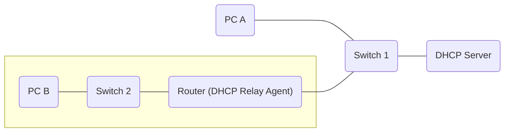

# DHCP



DORA process: *D*iscover, *O*ffer, *R*equest, *A*cknowledge

- *D*iscover: generally broadcast from `0.0.0.0` to `255.255.255.255` (no IP address yet, DHCP server unknown). There might be IP helpers or similar translating between different subnets, in which case the discover packet could be unicast as the helper knows the DHCP server.
- *O*ffer: can be declined
- *R*equest: host accepts IP addresses
- *A*cknowledge (`ACK`): can be NACK (not acknowledged) if there was a problem

After acknowledging the offer the machine will still check whether the IP address is already in use. The same might happen on the server. Some use ping, but since it's being blocked by a lot of firewalls ARP is better and mostly used. ARP is generally too essential to be blocked.

Monitor DHCP process (see [DHCP + DORA capture file](file://edu/gk_wireshark/dhcp_dora_icmp.pcapng))

```bash
dhclient -r # release lease
dhclient # request lease
```

Windows showed ARP requests to detect whether the IP is already in use. My Linux machine only shows ARP Announcements, suggesting no duplicate IP detection is performed or it's done in a different way. There are some (failed) ICMP packets, suggesting it might be using pings.

Example capture file from instructor: research network environment with problems

- Conversations/Endpoints shows `10.90.16.x` addresses, but also something private-looking `172.x.x.x`
- filtering for DHCP shows offers from different servers
- turns out someone hooked up their own hardware (improperly connected) and the device started handing out IP addresses

## IPv6

- stateful and stateless servers
- stateful: DHCP server provides everything (*Prefix/length*, *Host* info, *DNS server IP address*)
- stateless: through **NDP** (Neighbour Discovery Protocol) e.g. router can communicate PC *prefix/length*, PC can self-generate *Host* info using **EUI-64**, additional info such as *IP address DNS server* from DHCP server
