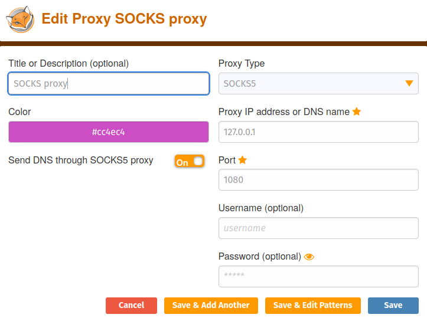
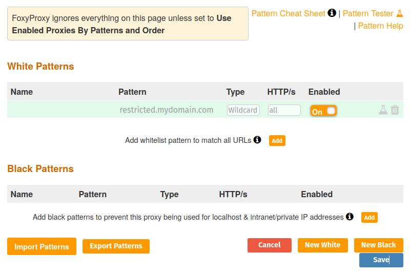
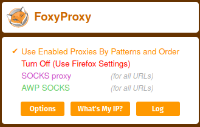

# Firefox

`=this.img` `= ("[Website](" + this.url + ")")` |  `= ("[Source](" + this.source + ")")` | `= ("[Documentation](" + this.docs + ")")`
`= ("> " + this.desc-short)`

## Config & Troubleshooting

- [Cookies permission button not working](https://support.mozilla.org/en-US/questions/1249232)

## Extensions

- [GNUzilla's list of free addons](http://www.gnu.org/software/gnuzilla/addons.html)

### FoxyProxy

Tags: #tech/firefox/extensions

Allows to use multiple proxy servers, selected by wildcard or regex patterns.

For example set up usage of a (SSH) SOCKS proxy[^1]

1. set up connection to SOCKS proxy, e.g. with port 1080 (standard port for SOCKS)
2. configure proxy
   IP address: 127.0.0.1
   port: 1080
3. edit patterns to match websites you want to access via proxy

[^1]: [[ssh#SOCKS proxy]]

## Alternatives

- [GNUzilla IceCat (formerly IceWeasel)](https://www.gnu.org/software/gnuzilla/)
