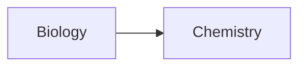
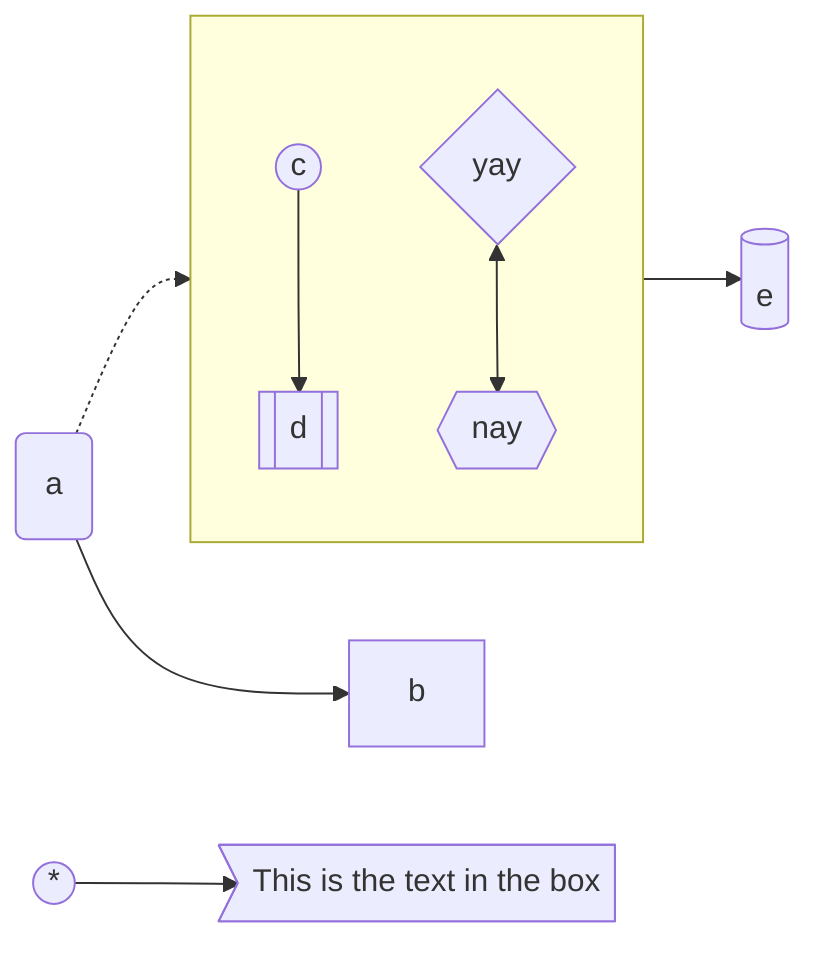
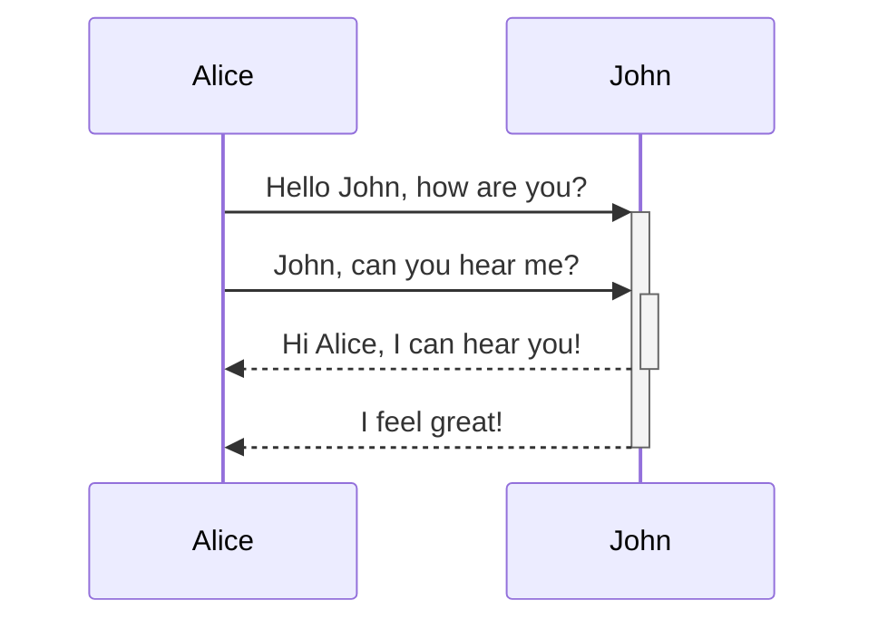
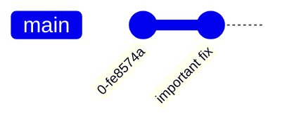

`= ("[Website](" + this.url + ")")` |  `= ("[Source](" + this.source + ")")` | `= ("[Documentation](" + this.docs + ")")` | [mermaid.live](https://mermaid.live/) | [My examples](file://rsc/mermaid)
`= ("> " + this.desc-short)`
Graph types
  - [Flowchart](https://mermaid.js.org/syntax/flowchart.html)
  - [Gantt](https://mermaid.js.org/syntax/gantt.html)
  - [Git](https://mermaid.js.org/syntax/gitgraph.html)
  - [ENR (Entity Relationship)](https://mermaid.js.org/syntax/entityRelationshipDiagram.html#entity-relationship-diagrams)
  - [Mindmap (experimental)](https://mermaid.js.org/syntax/mindmap.html)

## Tools
- [mermaid-cli](https://github.com/mermaid-js/mermaid-cli): Command line tool for the Mermaid library
  ```bash
  mmdc -i input.md -o output.svg -t dark -b transparent
  ```


## Config
- [Theme](https://mermaid.js.org/config/theming.html)
  - [Theme variables​](https://mermaid.js.org/config/theming.html#theme-variables)


## Examples
Issues
- connecting a node in a subgraph breaks the subgraph's `direction`

### Flow-Chart
simple graph with *internal links*


different node types, subgraphs, connections and a clickable external link


### Sequence


### Git


## Integration
- [[Pandoc]]: requires (lua) filter [[Pandoc#^959dc1|Pandoc Mermaid filter]]
- [[../documentation/MkDocs]] theme [[../documentation/MkDocs#mkdocs-material|material]] through [[Python-Markdown#Extensions|Python-Markdown extension]]