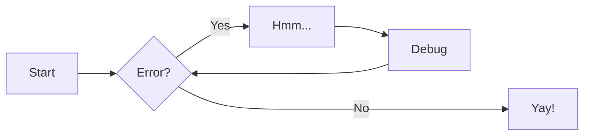

# h1

See [markdownguide.org](https://www.markdownguide.org) for basic and extended Markdown syntax.

Markdown is fairly relaxed regarding its syntax, e.g. indentation. However, different Markdown processors are more or less forgiving. Python-Markdown (MkDocs) for example, requires 4 spaces of indentation or things won't render properly.

## h2

### h3

#### h4

##### h5

```markdown
# h1

## h2

### h3

#### h4

##### h5
```

## Text Formatting

| Formatting    | Syntax                                           | Rendered                                     | Standard |
| ------------- | ------------------------------------------------ | -------------------------------------------- | -------- |
| italic        | `*using asterisks*` or `_using underscores_`     | *using asterisks* or _using underscores_     | ✅       |
| bold          | `**using asterisks**` or `__using underscores__` | **using asterisks** or __using underscores__ | ✅       |
| strike-though | `~~strike-through~~`                             | ~~strike-through~~                           | :x:      |
| highlight     | `==highlighted text==`                           | ==highlighted text==                         | :x:      |
| subscript     | `H~2~O`                                          | H~2~O                                        | :x:      |
| superscript   | `^13^C`                                          | Carbon-13 (^13^C)                            | :x:      |

## Lists

- unordered
    - list

1. ordered
    1. list

non-standard

item
:   definition

- [ ] check lists

```markdown
- unordered
    - list

1. ordered
    1. list

item
:   definition

- [ ] check lists
```

## Links and Images

- [Standard Markdown](<writing/Markdown#Specifications, Implementations and Parsers>): `[link text](path/URI "alt text")` (link description is optional)
- [[docs/seb_public/tech/writing/Markdown#^8eab7a|Wiki-links]] (non-standard): `[[path/to/file|link text]]`
- To embed images add an exclamation mark `!` to a markdown link (or Wiki-link if supported).

    Some Markdown processors support specifying attributes in the *alt text*, such as the size (width in pixels `200`, dimensions `400x200` or even horizontal alignment)

    ```markdown
    
    ```
    <figure>
    
    <caption><a href="https://pixabay.com/photos/books-leather-old-antique-binding-8405721/">Free Books Leather photo and picture by Joa70 via Pixabay</a></caption>
    </figure>


## Block Quotes

Pre-pended with `>␣`

> Don’t walk behind me; I may not lead. Don’t walk in front of me; I may not follow. Just walk beside me and be my friend.
> – Albert Camus

## Code

inline `code`: <code>&grave;code&grave;</code>

fenced code block with language syntax highlighting

```yaml title="Example fenced code block: YAML front matter"
---
title: Example Code Block
---
```

Syntax:

<pre><code>
&grave;&grave;&grave;yaml title="Example fenced code block: YAML front matter"
---
title: Example Code Block
---
&grave;&grave;&grave;
</code></pre>

Some Markdown processors allow for additional specifications beside a syntax language. Whether this results in unrendered crap if unsupported depends on your Markdown reader. Obsidian just ignores it. Some processors, such as Pandoc, use curly braces `{}` to specify options for fenced code blocks. Generally be aware of incompatibilities or stick to one Markdown implementation/reader, ideally one with high compatibility such as [[CommonMark]].

An alternative syntax for code blocks is simply by indentation. However this syntax is highly ambiguous,[^indentedcodeblock] does not have a way of specifying a code language for syntax highlighting and is therefore not recommended.

```markdown
Indented code blocks: mentioned for completion, but strongly discouraged

    bash script.sh
```

[^indentedcodeblock]: Python-Markdown for example expects 4 spaces of indentation. Other Markdown processors use 2 spaces and 4 spaces designate an indented code block. Beside rendering, this syntax is also unclear when reading the plain text Markdown. Many linters even complain about these code blocks. Just don't use them.

## Tables

See <https://www.markdownguide.org/extended-syntax/#tables>

| col1 | col2 | col3 |
| :---- | :---: | ---: |
| left-aligned | centered | right-aligned |

```markdown
| col1 | col2 | col3 |
| :---- | :---: | ---: |
| left-aligned | centered | right-aligned |
```

## Footnotes

Footnote referenced simply by number,[^1] and a longer one.[^longnote]

[^1]: easy to use, but you have to keep track of anchors to avoid duplicate definitions

[^longnote]: Longer footnotes with paragraphs

    just indent the contents

```markdown
Footnote referenced simply by number,[^1] and a longer one.[^longnote]

[^1]: easy to use, but you have to keep track of anchors to avoid duplicate definitions

[^longnote]: Longer footnotes with paragraphs

    just indent the contents
```

Some Markdown processors have additional syntax for direct definition of the footnote text, using the text in square brackets as the footnote text if not otherwise specified.^[e.g. Obsidian]

```markdown
Some Markdown processors have additional syntax for direct definition of the footnote text, using the text in square brackets as the footnote text if not otherwise specified.^[e.g. Obsidian]
```


## HTML

⚠ Don't mix HTML with Markdown, it usually doesn't render well.

Columns

<div style="display: flex; justify-content: space-between; width: 100%">
<div style="width: 45%">
col1<br>
Stick to HTML inside this construct. This will make it more difficult to use lists, tables and especially code blocks.
</div>
<div style="width: 45%">
col2<br>
However, things might render at least partially.

```html
<div style="display: flex; justify-content: space-between; width: 100%">
<div style="width: 45%">
col1
</div>
<div style="width: 45%">
col2
</div>
```
</div>
</div>

This happens to render fine in MkDocs (using [[Python-Markdown]]), but not in Obsidian.


## Tags

Tags are a helpful tool to categorise information and as bookmarks. They can be
specified for an entire page/note in the YAML front matter,

```yaml
tags: []
# or
tags:
  - tag1
  - tag2
```

or inline #markdown/tags

MkDocs (Python-Markdown) don't handle tags at a line start well and interpret
them as headings. Obsidian considers them as tags as it is assumed that headings
will have a space after the `#` symbol.


## Maths

inline: $\int_0^\infty \frac{1}{x} \text{d}x$

equation:

$$
    \int_0^\infty \frac{1}{x} \text{d}x = \ln |x| \Big|_0^\infty
$$

## Mermaid Graphs

Most Markdown processors have built-in support for Mermaid graphs. For some additional plugins are required.

See [mermaid.js.org](https://mermaid.js.org/) for syntax and graph types.

Example



<pre>
<code>&grave;&grave;&grave;mermaid
graph LR
  A[Start] --> B{Error?};
  B -->|Yes| C[Hmm...];
  C --> D[Debug];
  D --> B;
  B ---->|No| E[Yay!];
&grave;&grave;&grave;</code>
</pre>


## Emojis

Some Markdown processors support rendering emoji short codes (possibly requiring
a plugin). `:partying_face:` :partying_face:

Refer for example to this (not necessarily complete) [list of emoji shortcodes](https://gist.github.com/rxaviers/7360908).


## Admonitions or Call-outs


These are highlighted boxes and are another common Markdown extension. They feature a title line and usually distinct symbols and colours to stand out. As such they are great to emphasise important information. They are similar to the HTML tag `<details>` and can be collapsible as well.

!!! info "MkDocs admonitions"

    In MkDocs the extension `admonition` is required in `mkdocs.yml`. MkDocs uses the syntax

    ```markdown
    !!! type "title"
        content

    ??? tip "collapsible, collapsed by default"

    ???+ tip "collapsible, expanded by default"
    ```

    This is problematic for various reasons and renders poorly in systems not supporting this extension.

Obsidian uses the term call-out and the syntax

<!-- NOTE: Had to use HTLM pre+code for HTML entity &#62; (>), using Markdown
           plugins would replace Obsidian syntax with MkDocs syntax bc. of
           poor coding not respecting code blocks. Hence no syntax highlighting -->
<pre>
<code>&#62; [!type] title
&#62; content

&#62; [!type]- collapsed call-out
&#62; content

&#62; [!type]+ expanded call-out
&#62; content</code>
</pre>

rendering more reasonable in processors without this Markdown extension.

With MkDocs plugins this syntax can be kept and will be automatically translated
to MkDocs admonition syntax, see [mkdocs-callouts](https://github.com/sondregronas/mkdocs-callouts) and [mkdocs-obsidian-support-plugin](https://github.com/ndy2/mkdocs-obsidian-support-plugin).


<!--
## Embedding

MkDocs snippets

```yaml
--8<-- "mkdocs.yml"
```
-->
